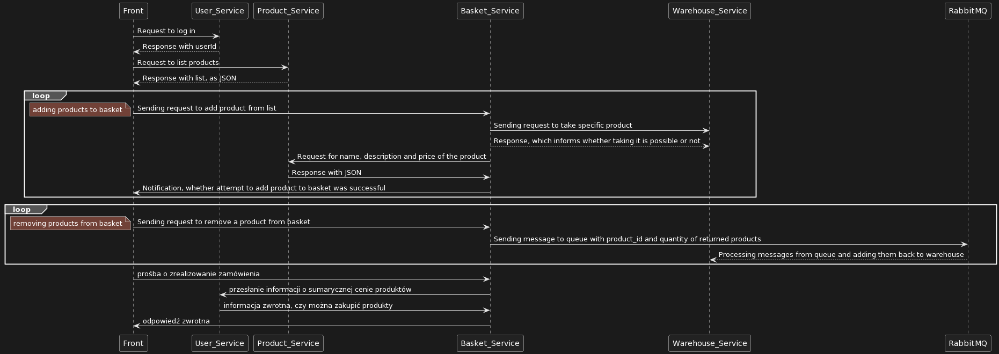

# jnp2-amazing
Project for JNP2 classes (Languages and programming tools 2), which was about writing microservices apps.

Technologies used:
+ Python (Flask)
+ React
+ sqlite3
+ RabbitMQ
+ Docker

App consists of following microservices:
+ Front
+ Product
+ Users
+ Warehouse
+ Basket

Diagram of communication between them:

