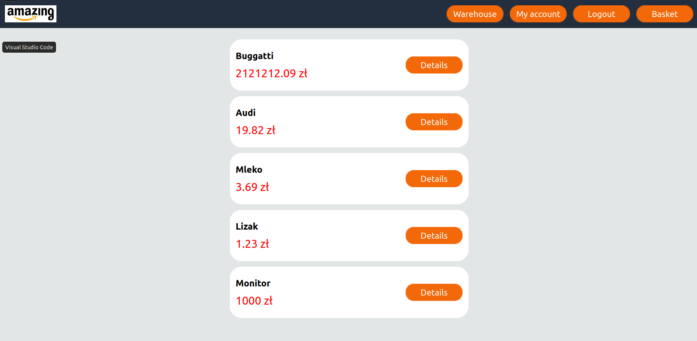
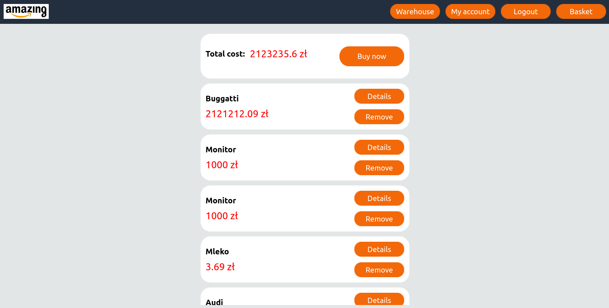
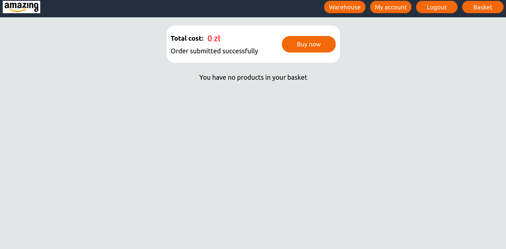

# jnp2-amazing
Project for JNP2 classes (Languages and programming tools 2) at the academic year 2022/23, which was about writing microservices apps.

Note: this is still an early version of the project, which is only for education purposes.

It is a simple e-commerce app, which resembles Amazon. People can log in, add products to basket
and try to buy them. Currently, users can just add money to themselves without any payment service (todo).
Admin can also add products to warehouse.

Technologies used:
+ Python (Flask)
+ React
+ sqlite3
+ RabbitMQ
+ Docker

App consists of following microservices:
+ Front
+ Product
+ Users
+ Warehouse
+ Basket

Diagram of communication between them:

Screenshots from the app:

+ Main site:

+ Basket:

+ Submitted order:
<<<<<<< HEAD
![Order][./images/order.png]

=======

>>>>>>> 8a5811e... Update README.md
